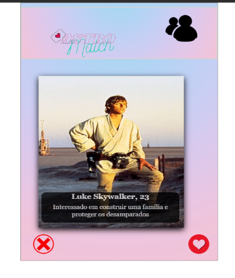
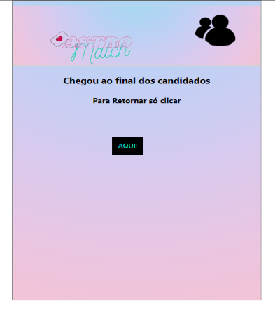
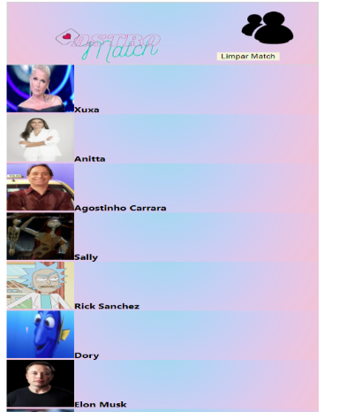
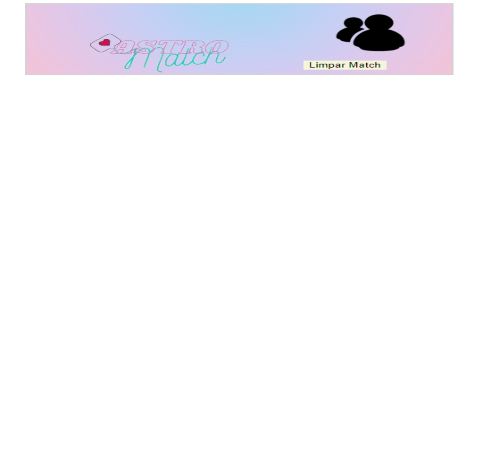

<h1>Projeto AstroMatch</h1>

---

Sendo uma versão clone de aplicativo para relacionamento

Um pequeno passo para a humanidade um grande passo para mim.

---

*Link Surge*
[==> Astromatch AQUI <==](http://erratic-vegetable.surge.sh/)

---
## Tecnologias utilizadas:

✅ React 
✅ Javascript 
✅ HTML 
✅ Styled Components 
✅ Hooks 
✅ API (Disponibilizada pela instituição Labenu) 

---

## Funcionalidades

- Página inicial com candidatos, podendo dar match ou não.

- Página inicial ao dar match possiveis candidatos serão passados para página Matchs. **Mas calma a vida amorosa pode decepcionar e demorar a vir o tão sonhado amor**

- Como a API tem suas limitações vai chegar ao fim, e será redirecionado a pagina se quiser continuar.

- Página de Matchs estará todo aquele que você e ele(a) se encontrarem.

- Página de Matchs também pode ser limpa excluindo todos os candidatos nela.

---

## Página inicial

**
Botões com funcionalidade ao clicar no coração possiveis condidados serão adicionais a página de matchs
**

---
## Página inicial quando chega ao fim da api

**
 Com funcionalidade ao botão para retornar ao inicio da API
**

---

## Página Matchs

**
Página que recebe matchs dados na página inicial
**

---

## Página Matchs após limpar candidados

--- 

**Desenvolvido com muito amor e dedicação**